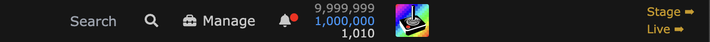
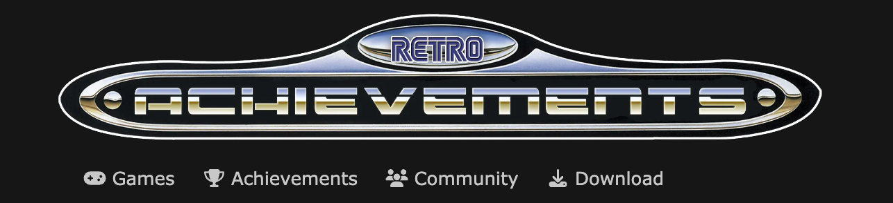

# RetroAchievements Userscripts

## Requirements
Userscript Manager of choice:
- [Tampermonkey](https://tampermonkey.net/)
- [Violentmonkey](https://violentmonkey.github.io/)
- [Greasemonkey](https://www.greasespot.net/)

## Userscripts

**[Web Helper](https://raw.githubusercontent.com/RetroAchievements/userscripts/master/dist/web-helper.user.js)** adds links to switch between environments

**[Plaque Logo](https://raw.githubusercontent.com/RetroAchievements/userscripts/master/dist/logo.user.js)** restores the old plaque logo on the front page

